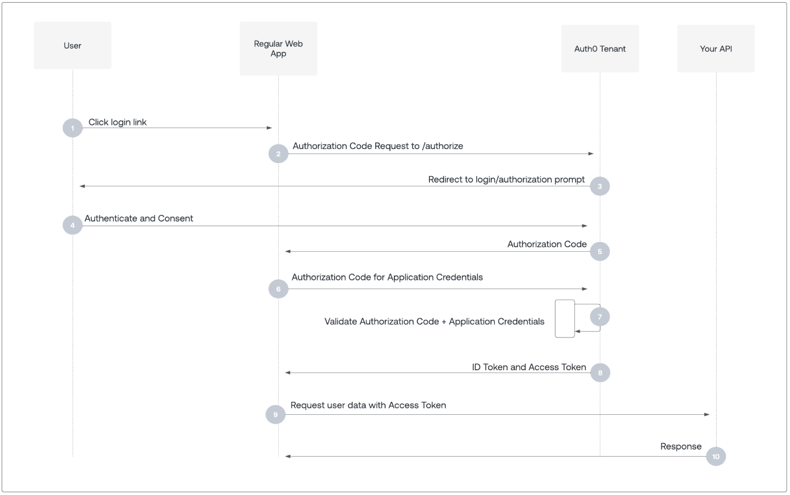

Intro
===

<!-- pause -->

A protocol to allow auth (login/roles/permissions)

<!-- new_lines: 2 -->

Shared standard that can allow for login with multiple providers in a standard way

<!-- new_lines: 2 -->

<!-- pause -->

You've seen it in use:

<!-- new_lines: 2 -->


----------

What is OAuth
===

<!-- pause -->

# Protocols

- A set of rules to follow to allow for data exchange between systems

<!-- pause -->
<!-- new_lines: 2 -->

# Auth

- Authorization: Prove who you are
- Authentication: What can you access

<!-- pause -->
<!-- new_lines: 2 -->

# OAuth

- OAuth 2.0 is an authorization protocol
- OpenId Connect: is an authentication protocol, an extension to OAuth

<!-- pause -->
<!-- new_lines: 2 -->

# Advantages

- a well researched and tested standard
- can more easily implement login via multiple providers as they all follow the same standard
- supports token expiration and revocation
- provides a means of validating access at the api level 

e.g. you can know who the user is for your api request, and can validate that the information is legitimate

<!-- pause -->

- reduces the need for users to create and remember new passwords e.g. login with google
- limits the amount of data shared with third-party apps e.g. request access to data/actions from user on sign up

----------

User Consent
===


---------
Admin Consent
===


---------

OAuth Roles
===

<!-- pause -->

# Resource owner

- The user who 'owns' the data being accessed, they will need to approve the client access to the resources

<!-- new_lines: 2 -->
<!-- pause -->

# Client 

- The application the user is logging into e.g. your website

<!-- new_lines: 2 -->
<!-- pause -->

# Resource server 

- The server that holds the info they are requesting e.g. your api

<!-- new_lines: 2 -->
<!-- pause -->

# Auth server 

- The server that handles and validates logins e.g. Azure Entra

----------

Flows
===

<!-- pause -->

There are different request/response flows that work for different scenarios

Choose which flow to use: 

https://auth0.com/docs/get-started/authentication-and-authorization-flow/which-oauth-2-0-flow-should-i-use

<!-- pause -->
<!-- new_lines: 2 -->

# Client credentials 

No user involved, e.g. a scheduled task, or access before users have logged in

- Simplest flow, essentially a password owned/managed by your application

<!-- pause -->

# Resource owner password flow

Traditional password login, discouraged unless you control the auth server and the client

- simpler than auth code flow, no need for user granting access step

<!-- pause -->

# Authorization code

The default

- user approves access

<!-- pause -->

# Authorization code with pkce

(Proof Key for Code Exchange)

- more complicated but allows for use on client side applications (can't have a client secret exposed on a client side app)

--------

Client Credentials
===


--------

Resource Owner Password Flow
===


--------

Authorization Code
===



--------

Authorization Code (pkce)
===


--------
Request
===
<!-- column_layout: [3,1] -->
<!-- column: 0 -->

<!-- pause -->

client_secret_post
```yaml
headers:
  Content-Type: 'application/x-www-form-urlencoded'
body:
  grant_type: client_credentials
  client_id: 4dbd45cb-f591-414f-a6d9-34f1103b63fd
  client_secret: forms-web-app-local-secret
```

<!-- pause -->
<!-- new_lines: 2 -->

Could use basic http auth instead

--------

Response
===

<!-- pause -->

# Access Token

https://jwt.io/

A url safe format for sending , can use other formats but this is the most common

A JWT consists of three parts, separated by dots (.): 

`header.payload.signature`

<!-- pause -->

## Header:
Metadata about the token, such as the type and the signing algorithm

<!-- pause -->

## Payload:
Contains the claims or data (like user ID, roles, expiration time). This part is base64-encoded JSON.

<!-- pause -->

## Signature:
Used to verify that the token hasn’t been tampered with. It’s created by signing the header and payload with a secret key or private key.

<!-- pause -->
<!-- new_lines: 2 -->

# ID Token

- Can be returned alongside access token
- Request access to additional scopes/claims as part of token request
- Additional detail about who the user is and what they can access
- Also a JWT, also signed

-------

Example Access Token
===
<!-- column_layout: [3,1] -->
<!-- column: 0 -->

<!-- pause -->

# Header
```json
{
  "alg": "RS256", 
  // RSA, an asymmetric encryption algorithm, using SHA-256 hashing algorithm.
  "typ": "at+jwt", 
  // access token + jwt
  "kid": "XifmCWOEnrqX9p_wM6TFChZKbwrvEvE3vRALG5hKVCs" 
  // public key id for validating signature see http://localhost:3005/oidc/jwks
}
```
<!-- pause -->

# Payload
```json
{
  "jti": "2dlgqtxValkOO8i3i8lVF", // token id
  "sub": "e930d478-1caa-4214-b33a-fe3a9a97f869", // user id
  "iat": 1748055109, // issued at time
  "exp": 1748141509, // expiry time
  "scope": "openid userinfo email", // scopes
  "client_id": "4dbd45cb-f591-414f-a6d9-34f1103b63fd", // client
  "iss": "http://localhost:3000", // issuer
  "aud": "http://appeals-front-office" // audience
}
```

----------

Example ID Token
===
<!-- column_layout: [3,1] -->
<!-- column: 0 -->

<!-- pause -->

# Header
```json
{
  "alg": "RS256",
  "typ": "JWT", // plain jwt
  "kid": "XifmCWOEnrqX9p_wM6TFChZKbwrvEvE3vRALG5hKVCs"
}
```
<!-- pause -->

# Payload
```json
{
  "sub": "abc", // user id
  "email": "test@example.com",
  "aud": "123", // client
  "exp": 1748141509,
  "iat": 1748055109,
  "iss": "http://localhost:3000"
}
```

----------

Validating Tokens
===

<!-- pause -->

# .well-known

Auth server will have an endpoint that provides publicly available info on how to use it/what it supports

e.g. algorithms, flows, public keys etc

<!-- pause -->
<!-- new_lines: 2 -->

# Appeals:
https://pins-app-appeals-service-auth-server-dev-ukw-001.azurewebsites.net/oidc/.well-known/openid-configuration

<!-- pause -->
<!-- new_lines: 2 -->

# Azure
https://login.microsoftonline.com/{tenant}/v2.0/.well-known/openid-configuration

e.g. https://login.microsoftonline.com/5878df98-6f88-48ab-9322-998ce557088d/v2.0/.well-known/openid-configuration

<!-- pause -->

- Auth server will have a public/private key pair (multiple to allow for rotation)
- The tokens will be signed with the private key
- Resource servers can validate by finding the public key and ensuring the signature + message match
- This key can be cached to reduce auth server load

<!-- pause -->
<!-- new_lines: 2 -->

Learn more on cryptography with Computerphile - Mike Pound!

-------

Postman
===

<!-- column_layout: [3,1] -->
<!-- column: 0 -->

<!-- pause -->

# Get: http://localhost:3005/oidc/.well-known/openid-configuration

<!-- pause -->

# POST: http://localhost:3005/oidc/token
Body:
```yaml
grant_type: client_credentials
client_id: 4dbd45cb-f591-414f-a6d9-34f1103b63fd
client_secret: forms-web-app-local-secret
resource: http://appeals-front-office
```

<!-- pause -->

# POST: http://localhost:3005/oidc/token
The above +
```yaml
grant_type: otp
email: test@example.com
```

<!-- pause -->

# POST: http://localhost:3005/oidc/token
The above +
```yaml
grant_type: ropc
email: test@example.com
otp: 12345
scope: openid userinfo email
```

----------

Scopes
===

<!-- pause -->

Scopes in OAuth/OpenID Connect define what access or permissions the client application is requesting from the user or resource server. They are strings included in the authorization request that specify which resources or actions the application wants to access on behalf of the user. The user is shown which scopes the app is requesting during the consent step.

<!-- pause -->

Examples:

- openid: Request authentication via OpenID Connect.
- email: Access the user's email address.
- profile: Access basic profile information.
- userinfo: Access user information.
- Custom scopes: Application-specific permissions (e.g., read:messages, write:files)

----------

Refresh Tokens
===

<!-- pause -->

Access token should for security best practices have a relatively short expiration.

But this leads to user needing to login more often.

Can help this with use of a refresh token.

<!-- pause -->

A refresh token is a token issued alongside the access token by the authorization server that allows a client application to obtain a new access token without requiring the user to log in again.

When the access token expires, the app sends the refresh token to the server to get a new access token.

<!-- pause -->
Can allow revocation of the refresh token and cache the access token verification

----------

Azure Entra ID (previously Azure AD)
===

<!-- pause -->

# App Registrations
Set up your client application
<!-- pause -->

# Permissions
Grant permissions to resources and either admin approve or support user approval flows
<!-- pause -->

# Client ID
Static the application that is logging in
<!-- pause -->

# Client Secret
Can rotate, expire, and cancel these

----------

References
===

<!-- pause -->

- https://developer.mozilla.org/

- https://auth0.com/

- https://learn.microsoft.com/

- Computerphile


---
tags:
  - auth
  - oauth
  - present
---